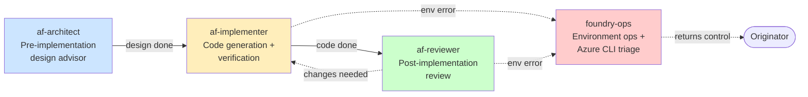

# Chatmode (Agent) Catalog — 4 Specialist Personas

> [!NOTE]
> Each `.github/agents/*.agent.md` file defines a **Copilot chatmode** — a persona with
> specific objectives, tool access, and hand-off conventions. The 4 chatmodes cover the
> full agent-development lifecycle: design → implementation → review → environment ops.

## All chatmodes at a glance



| Chatmode | Persona | Tools | Hands-off to | Hand-off in |
|---|---|---|---|---|
| `af-architect` | Pre-impl design advisor | read, search | `af-implementer` | (user) |
| `af-implementer` | Code generation + verification | read, search, edit, execute | `af-reviewer`, `foundry-ops` (escalation) | `af-architect`, user |
| `af-reviewer` | Post-impl reviewer | read, search | `af-implementer`, `foundry-ops` | `af-implementer`, user |
| `foundry-ops` | Foundry environment specialist | **read, search ONLY** | Originator (never downstream) | All execute-capable modes |

## `af-architect`

**Persona**: Pre-implementation design advisor. Translates feature ideas into structured design briefs that `af-implementer` can convert to code.

**Objectives (priority order)**:
1. Capture user intent precisely (no assumption)
2. Map to existing Agent Framework patterns
3. Identify risks + edge cases BEFORE implementation
4. Produce a structured design brief
5. Hand off to `af-implementer` with full context

**When to use**: User describes a feature in natural language → architect produces design brief → implementer codes.

**Output**: Markdown design brief with sections:
- Goal
- Approach
- Files affected
- KB patterns referenced
- Risks + mitigations
- Acceptance criteria
- Hand-off payload to `af-implementer`

**Doesn't do**: Write code, run commands, deploy.

---

## `af-implementer`

**Persona**: Development agent that implements Python agents on Microsoft Agent Framework 1.8.0. Reads design briefs (from `af-architect`), produces code diffs, runs verification.

**Objectives (priority order)**:
1. Implement exactly what's in the design brief (no scope creep)
2. Follow `.github/instructions/python.instructions.md` rules
3. Cite KB patterns in commit messages
4. Run verification gates (compileall, pytest at minimum)
5. Hand off to `af-reviewer` for diff review

**Companion prompts** (most-invoked):
- `add-tool`, `add-mcp-tool`, `add-agent` for additive changes
- `add-bing-grounding`, `add-foundry-toolbox`, `add-hosted-file-search` for integrations
- `migrate-from-1.5`, `migrate-to-1.8` for version upgrades
- `verify-template` as a gate

**Escalation**: If verification reveals an environment error (Azure CLI, RBAC, DNS), escalate to `foundry-ops` for triage.

**Hand-off**: Routes to `af-reviewer` post-implementation (or back to `af-architect` if design needs revision).

---

## `af-reviewer`

**Persona**: Post-implementation code reviewer. Scans Python diffs and PRs for AF best-practice violations and anti-patterns.

**Objectives (priority order)**:
1. Identify BLOCKERs first (production-blocking defects)
2. Surface IMPORTANT issues (UX / maintainability)
3. Note NIT-level suggestions
4. Verify hand-off payload completeness from `af-implementer`
5. Use `review-report-format` skill for output structure

**Companion prompts**:
- `review-pre-merge` — full diff review with severity grading
- `scan-anti-patterns` — narrow scan against the 17 `kb-1.8.0/anti-patterns/*.md` entries

**Escalation**: If a finding requires Foundry environment changes (e.g., missing RBAC, DNS misconfiguration), hand off to `foundry-ops`.

**Output format** (via `review-report-format` skill):
- Severity-grouped findings (BLOCKER / IMPORTANT / NIT / INFO)
- Confidence-tagged (HIGH / MEDIUM / LOW)
- KB citations on each finding
- Hand-off payload for follow-up work

---

## `foundry-ops` (the special one)

**Persona**: Microsoft Foundry environment specialist. Handles provisioning, RBAC, model deployments, connections, observability, and triage.

**Tools allowlist**: **READ + SEARCH only** (no execute). Every `az` command is conversational markdown — human reviews + runs.

**Key safety boundary** (R-PHASE3-RISK-1):
> `foundry-ops` **NEVER hands off downstream**. It always returns control to the originator
> (the calling chatmode or user). This prevents privilege-escalation chains where
> environment ops bypass safety review by other chatmodes.

**Triage Catalogue** (6 categories, as of PR #5 / F3):

| Category | Coverage | Example |
|---|---|---|
| A. Provisioning / RBAC | 7 rows | "Missing project-scope `Azure AI User` role" |
| B. Model deployment / runtime | 5 rows | "Deployment name typo (identifier vs deployment name)" |
| C. Networking / DNS | 3 rows | "Private endpoint blocking Codespaces egress" |
| D. Connections / tools | 3 rows | "Wrong connection kind (Bing vs AzureOpenAI)" |
| E. Identity / observability | 5 rows | "MI not granted project-scope roles" |
| **F. Container / ACR / hosted-agent runtime** (NEW in F3) | 7 rows | "AZURE_TENANT_ID not set → event-postdeploy fails" (G5 finding) |

**Companion prompts**:
- `triage-foundry-error` — narrow wrapper for stacktrace → Triage Catalogue routing
- `provision-foundry` — new project + AI Services account + model deployment
- `deploy-agent-to-foundry` — `azd ai agent` extension flow (NEW canonical pattern post-Plan E)
- `rotate-credentials` — destructive key rotation (with 2-turn confirmation gate)

**Safety command emission protocol**: Every command is tagged with safety class:
- 🟢 READ — safe to run
- 🟡 MUTATING-IDEMPOTENT — safe to re-run, treats existing-state errors as success
- 🟠 MUTATING — re-run may have unintended effects
- 🔴 DESTRUCTIVE — requires explicit user confirmation
- 🔴 DESTRUCTIVE-RECOVERABLE — uses soft-delete or 2-turn gate (e.g., `azd down --purge`)

---

## Companion-prompt matrix

| Prompt | Companion chatmode | Hand-off target |
|---|---|---|
| `add-agent`, `add-tool`, `add-mcp-tool` | af-implementer | af-reviewer |
| `add-bing-grounding`, `add-foundry-toolbox`, `add-hosted-file-search` | af-implementer | af-reviewer |
| `add-foundry-evaluation` | af-implementer | af-reviewer |
| `migrate-from-1.5` | af-implementer | af-reviewer |
| `migrate-to-1.8` | af-reviewer | af-reviewer |
| `review-pre-merge`, `scan-anti-patterns` | af-reviewer | af-implementer |
| `verify-template` | af-implementer | af-reviewer |
| `provision-foundry`, `deploy-agent-to-foundry`, `triage-foundry-error` | foundry-ops | foundry-ops |
| `rotate-credentials` | foundry-ops | af-implementer (after rotation) |

## Hand-off payload contract

All chatmodes use a common hand-off payload structure (validated by `tests/test_handoff_payload_contracts.py`):

```json
{
  "from": "<chatmode>",
  "to": "<target chatmode>",
  "context": "<problem statement>",
  "artifacts": ["<file paths produced>"],
  "next_action": "<specific action>",
  "open_questions": ["<unresolved items>"]
}
```

## See also

- [`./prompt-catalog.md`](./prompt-catalog.md) — 17 prompts these chatmodes invoke
- [`./skill-catalog.md`](./skill-catalog.md) — 3 composite skills
- [`./architecture-overview.md`](./architecture-overview.md) — system view
- [`./scenarios.md`](./scenarios.md) — when to invoke which chatmode for which scenario
- `.github/agents/*.agent.md` — source-of-truth chatmode definitions
- `tests/payload-contracts/handoff-v1.json` — hand-off payload JSON schema
