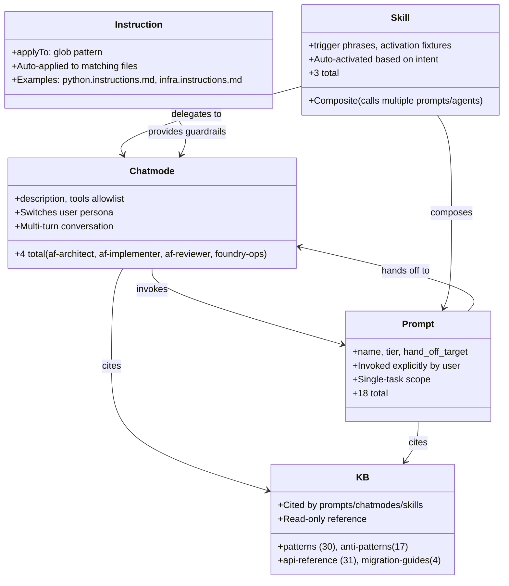
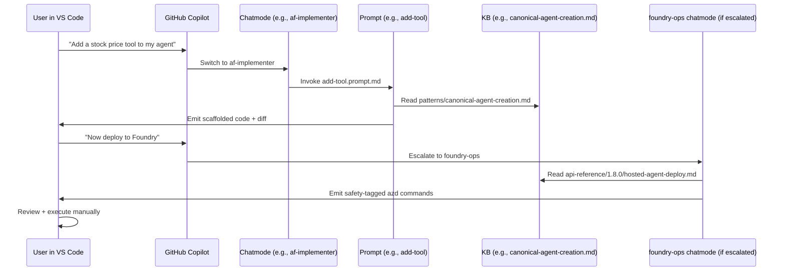
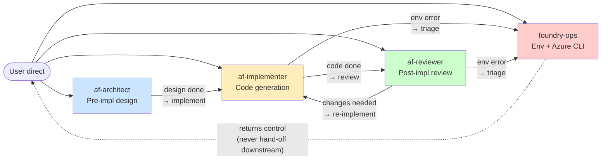
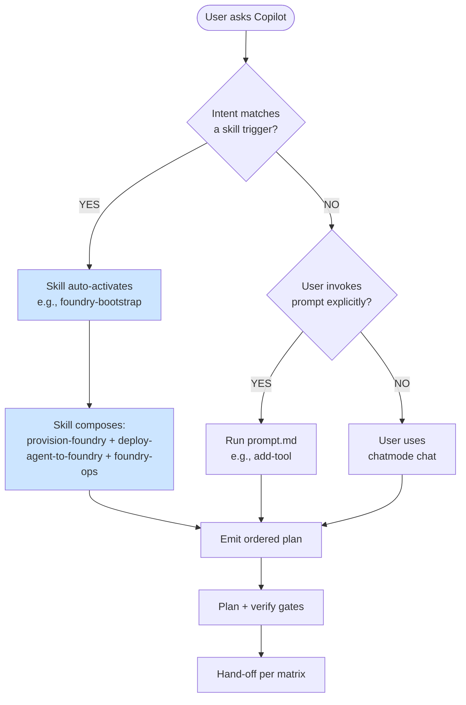
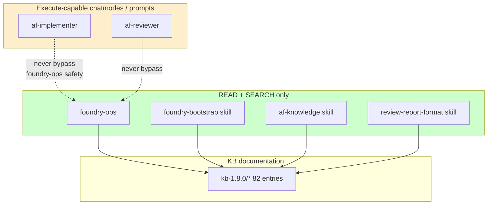
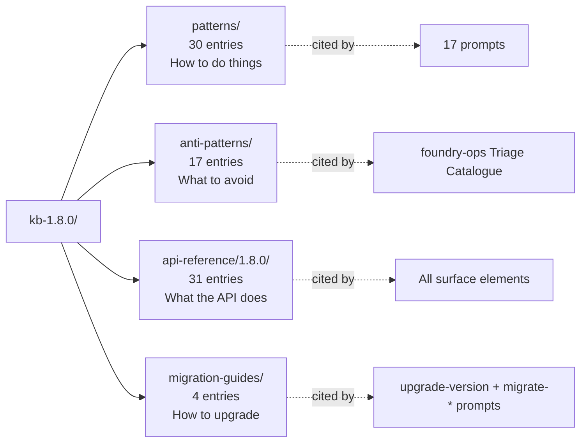

# Copilot Surface Architecture Overview

> [!NOTE]
> This document explains how the **25 Copilot-facing components** in `.github/` interact:
> 17 prompts + 3 skills + 4 chatmodes + 4 instructions, plus the 82-entry knowledge base
> in `kb-1.8.0/` and the 5 starter templates in `templates/`.

## Who is this for?

- Developers extending the template who want to know **where to add a new prompt vs chatmode vs skill**
- Reviewers evaluating the template who want a **system-level mental model**
- New contributors trying to find **which file does what**

## The 5 Copilot surface element types

## How a user interaction flows

## Chatmode hand-off matrix

The 4 chatmodes are NOT independent — they hand off via a documented matrix to keep
responsibilities clean.

> [!IMPORTANT]
> **`foundry-ops` is special**: it never hands off downstream. It always returns control to
> the originating chatmode (or user). This is the **R-PHASE3-RISK-1 safety boundary** —
> environment ops are read+search only, never execute.

## Prompt invocation flow

## Safety boundaries (R-PHASE3-RISK-1)

**Key rule**: `foundry-ops` emits `az` commands as **conversational markdown**, never
executes them. Composite skills inherit this boundary.

## Instructions (auto-applied guardrails)

The 4 `.github/instructions/*.md` files are auto-applied by Copilot to files matching
their `applyTo` glob:

| File | applyTo | Purpose |
|---|---|---|
| `python.instructions.md` | `**/*.py` | Python coding conventions (typing, structure, AGENTS.md alignment) |
| `tests.instructions.md` | `**/tests/**/*.py` | Test-specific conventions (AST parity, pytest patterns) |
| `infra.instructions.md` | `**/*.bicep,**/azure.yaml,**/main.parameters.json` | Bicep RBAC patterns, az CLI vs azd traps, principalType conventions |
| `docs.instructions.md` | `**/*.md` | Markdown style + frontmatter requirements |

These are **transparent** to the user — Copilot consults them automatically when editing
matching files. No explicit invocation needed.

## KB anatomy

## When to add what

| You want to… | Add a… | Example |
|---|---|---|
| Provide a one-shot capability to users | **Prompt** | `add-stripe-payments.prompt.md` |
| Compose multiple capabilities for a common flow | **Skill** | `setup-payment-stack` (composes `add-stripe` + `add-vat` + `deploy-checkout`) |
| Provide a specialist persona for a domain | **Chatmode** | `db-ops.agent.md` for database admin work |
| Auto-apply rules to file types | **Instruction** | `terraform.instructions.md` for `.tf` files |
| Document a working pattern | **KB pattern** | `kb-1.8.0/patterns/payment-webhook-handling.md` |
| Document a known failure mode | **KB anti-pattern** | `kb-1.8.0/anti-patterns/stripe-webhook-replay-attack.md` |

## See also

- [`./prompt-catalog.md`](./prompt-catalog.md) — all 17 prompts × purpose / when / inputs / hand-off
- [`./skill-catalog.md`](./skill-catalog.md) — all 3 skills × triggers + composite workflow
- [`./agent-catalog.md`](./agent-catalog.md) — all 4 chatmodes × objectives + safety
- [`./scenarios.md`](./scenarios.md) — all 5 starters × usage scenarios
- [`./template-design-principles.md`](./template-design-principles.md) — meta design rules
- [`../CHANGELOG.md`](../CHANGELOG.md) — recent changes
