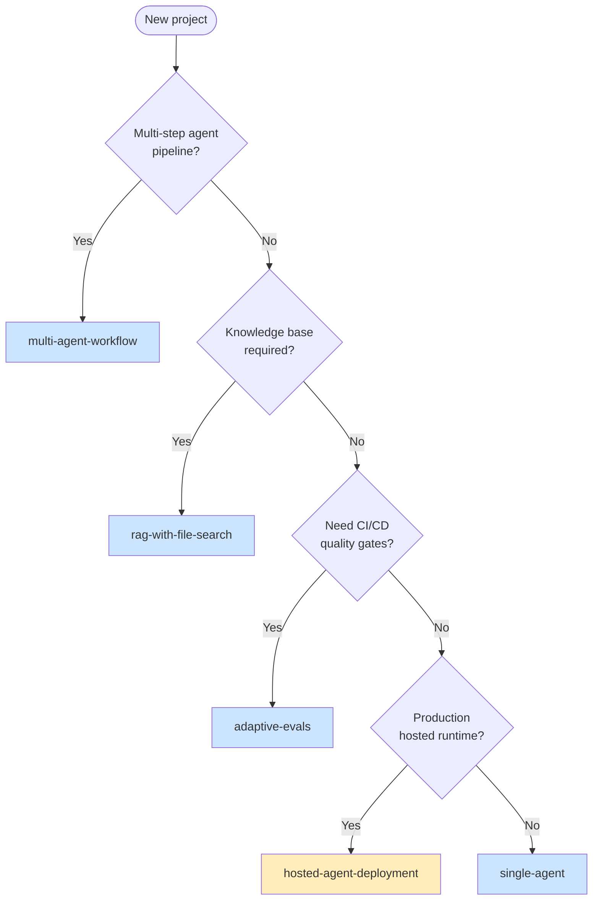

# Template Scenarios — When to Use What

> [!NOTE]
> For each of the 5 starter templates in `templates/`, this document answers:
> **Who is this for?** / **What scenarios does it best fit?** / **Which Copilot prompt
> sequence extends it?** / **What KB patterns apply?**

## Decision matrix: which starter to derive from



| Starter | Best fit when… |
|---|---|
| `single-agent` | One agent, one purpose, custom tools |
| `multi-agent-workflow` | Triage / specialist / handoff patterns |
| `rag-with-file-search` | Internal knowledge base Q&A |
| `adaptive-evals` | CI/CD quality gates on agent responses |
| `hosted-agent-deployment` | Production-deployed Foundry hosted agent (containerized) |

---

## `single-agent` — minimum-viable agent

### Scenarios
- **Internal helpdesk bot**: Single agent answers FAQ
- **Customer support frontend**: Initial triage before human escalation
- **API documentation assistant**: Answers questions about your API
- **Code review companion**: Reviews diffs against team conventions

### Target audience
First-time AF user, MVP development, single-purpose chatbots.

### Extension prompt sequence
```
1. add-tool             # Add custom Python tool (e.g., DB query)
2. add-bing-grounding   # If web freshness needed
3. add-foundry-evaluation  # When ready for CI/CD quality gates
```

### KB patterns to read
- `kb-1.8.0/patterns/canonical-agent-creation.md`
- `kb-1.8.0/anti-patterns/missing-async-with-cleanup.md`
- `kb-1.8.0/api-reference/1.8.0/agents.md`

### Production deploy
For hosted runtime, additionally derive from `hosted-agent-deployment` and migrate this starter's main.py into `src/<agent>/main.py`.

---

## `multi-agent-workflow` — chain + handoff patterns

### Scenarios
- **Customer support triage**: frontline → billing/technical/account specialist
- **Document processing pipeline**: extract → classify → enrich → store
- **Multi-language translator**: detect language → translate → review → format
- **Research assistant**: search → summarize → fact-check → cite

### Target audience
Teams building production multi-step agent pipelines.

### Extension prompt sequence
```
1. add-agent                  # Add new specialist agent
2. add-tool                   # Add tools to specialist
3. add-foundry-evaluation     # Per-agent quality gates
4. (verify-template)          # Pre-merge gate
```

### KB patterns to read
- `kb-1.8.0/patterns/multi-agent-workflow.md`
- `kb-1.8.0/patterns/workflow-as-agent-nesting.md`
- `kb-1.8.0/patterns/agent-as-tool-handoff.md`
- `kb-1.8.0/api-reference/1.8.0/workflows.md`

### Live test focus
Workflow streaming events: `event.type == "intermediate"` (NOT `isinstance(event, ...)`).

---

## `rag-with-file-search` — hosted file_search + citations

### Scenarios
- **Policy / HR assistant**: Answer employee questions about company handbook
- **Internal docs Q&A**: Engineering team knowledge base
- **Customer support KB**: Public help docs RAG
- **Research assistant**: PDF library indexing + querying

### Target audience
Teams with curated knowledge bases (50-500 documents typically).

### Extension prompt sequence
```
1. add-hosted-file-search    # If you cloned the starter from scratch (already there in template)
2. add-tool                  # Add custom tools alongside file_search
3. add-bing-grounding        # Combine RAG with web for hybrid answers
```

### KB patterns to read
- `kb-1.8.0/patterns/rag-with-file-search.md`
- `kb-1.8.0/patterns/rag-with-azure-ai-search.md` (alternative for large corpora)
- `kb-1.8.0/api-reference/1.8.0/tools-hosted.md` § file_search

### Cycle 3 positive finding (built into template)
Hosted file_search returns **source-filename citations automatically** without
prompt-engineering. The starter's instructions explicitly leverage this.

---

## `adaptive-evals` — quality-gate the agent

### Scenarios
- **Pre-merge quality gate**: Block PRs that degrade response quality
- **Regression test for agent prompts**: Detect quality drift after instruction changes
- **A/B test agent variants**: Compare evaluator scores across configurations
- **Production monitoring sampling**: Periodic quality checks on live agent

### Target audience
Teams with established agents who want to **prevent quality regressions**.

### Extension prompt sequence
```
1. add-foundry-evaluation    # Add additional evaluator rubrics
2. (Tier-A) require_applicable=True  # Always set this on assert helpers (Cycle 4 B2 lesson)
3. verify-template           # Pre-merge gate
```

### KB patterns to read
- `kb-1.8.0/patterns/agent-evaluation-foundry.md`
- `kb-1.8.0/patterns/workflow-evaluation.md`
- `kb-1.8.0/anti-patterns/eval-as-test-substitute.md`
- `kb-1.8.0/anti-patterns/foundry-environment-pitfalls.md` § P-7 (FoundryEvals judge model default)

### Cycle 4 lessons baked in
- B1: NEVER `async with FoundryChatClient(...)` directly — wrap credential + `as_agent()` instead
- B2: Always pass `require_applicable=True` to assert helpers — otherwise silent-PASS on missing dimensions

---

## `hosted-agent-deployment` — production Foundry hosted agent

### Scenarios
- **Production agent backend**: Containerized agent serving production traffic
- **Multi-tenant agent service**: Foundry-managed scaling per agent
- **Customer-facing chatbot**: Production deployment with managed identity + observability
- **Public agent API**: Responses-protocol-compliant endpoint

### Target audience
**Production engineers** deploying agents to Foundry runtime (not local dev).

### ⚠️ Region constraint
**Hosted agents are `northcentralus`-only** (different from workshop-wide default `eastus`).
This is documented inline in the starter's `.env.example` + README.

### Extension prompt sequence
```
1. (verify Flow 1 local first)   # python main.py at template root
2. deploy-agent-to-foundry        # azd ai agent extension flow
3. (verify post-deploy)            # azd ai agent invoke + check Application Insights trace
```

### KB patterns to read
- `kb-1.8.0/api-reference/1.8.0/hosted-agent-deploy.md` ⭐ (canonical workflow)
- `kb-1.8.0/api-reference/1.8.0/agent-manifest-yaml.md` (kind: hosted schema)
- `kb-1.8.0/api-reference/1.8.0/hosted-agent-region-availability.md`
- `kb-1.8.0/anti-patterns/azure-yaml-missing-services-block.md` (Cycle 5b C-noop guard)
- `kb-1.8.0/anti-patterns/agentfactory-confused-with-hosted-deploy.md` (Cycle 5b B-quirk)

### Lessons from Plan E (validated end-to-end via Cycle 6)
- C1: Use canonical `Azure-Samples/azd-ai-starter-basic` infra (subscription scope + sub-modules in `infra/core/`)
- G4: `services.<agent>.host=azure.ai.agent` REQUIRED (else `azd up` is infra-only)
- F1: Use `kind: hosted` + `protocols: [responses]` agent.yaml (NOT `kind: Prompt`)
- C-noop: `services:` block in azure.yaml REQUIRED (else `azd deploy` silent-PASS)
- G5: Set `AZURE_TENANT_ID` (else `event-postdeploy` hook fails confusingly)

---

## Cross-starter combinations

Real production projects often combine multiple starters' patterns:

| Combination | Approach |
|---|---|
| `single-agent` + RAG | Derive `single-agent`, then `add-hosted-file-search` |
| `multi-agent-workflow` + Evals | Derive `multi-agent-workflow`, then `add-foundry-evaluation` per agent |
| `single-agent` + Hosted deploy | Derive `hosted-agent-deployment`, migrate `single-agent` main.py into `src/<agent>/` |
| `rag-with-file-search` + Hosted deploy | Derive `hosted-agent-deployment`, add file_search tool to container agent |
| Workshop demo → Template starter | See [Workshop's `docs/scenarios-catalog.md`](https://github.com/shinyay/getting-started-with-agent-framework/blob/main/docs/scenarios-catalog.md) for demo-to-starter mapping |

## Verification checklist (any starter)

Before opening a PR with changes to a starter, run:
```bash
python3 -m compileall -q templates/<starter>/
python3 -m pytest tests/test_template_<starter>.py -v
python3 -m pytest tests/ -q --tb=no   # full suite (68 tests post-PR #6)
```

For full verify-template gate suite, invoke `verify-template.prompt.md` (10 gates including frontmatter + kb-link integrity + bicep build).

## See also

- [`./prompt-catalog.md`](./prompt-catalog.md) — 17 extension prompts
- [`./skill-catalog.md`](./skill-catalog.md) — `foundry-bootstrap` composite skill
- [`./agent-catalog.md`](./agent-catalog.md) — 4 chatmodes
- [`./architecture-overview.md`](./architecture-overview.md) — system view
- Workshop's [`docs/scenarios-catalog.md`](https://github.com/shinyay/getting-started-with-agent-framework/blob/main/docs/scenarios-catalog.md) — workshop demos → these starters mapping
- Dryrun's [`docs/lessons-learned.md`](https://github.com/shinyay/ms-agent-framework-dryrun-v1.8.0/blob/main/docs/lessons-learned.md) — why these patterns are correct
